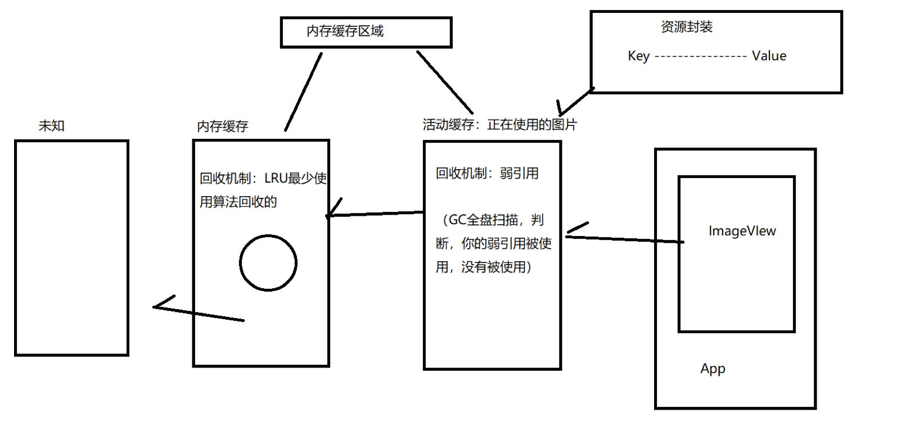
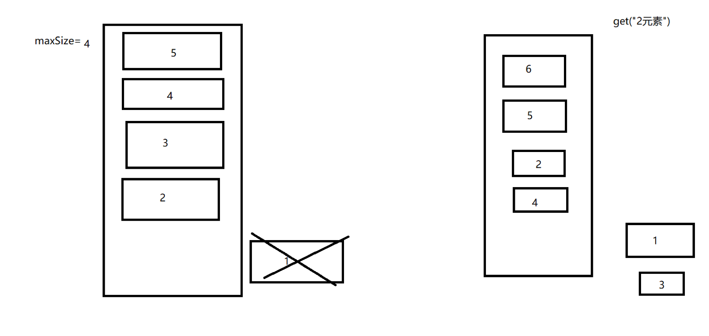
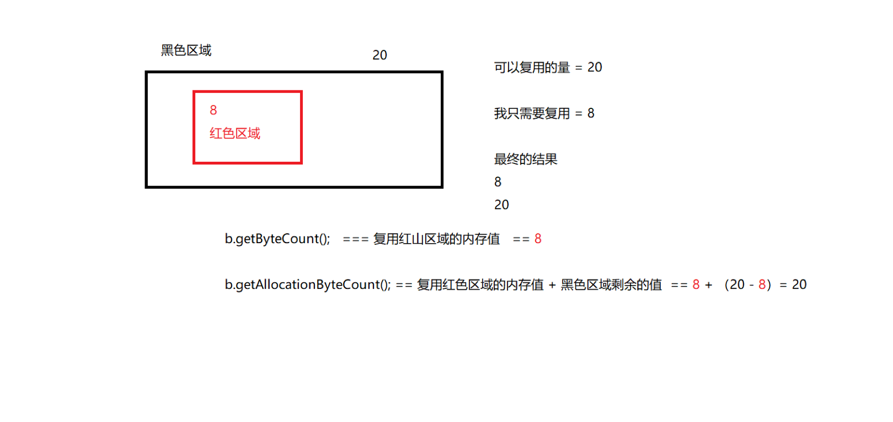

# 1.Gilde 资源封装

Key--对Value的唯一性描述 Value--Bitmap的封装（+1，-1，释放）

# 2.活动缓存

GC全盘扫描 判断 你的弱引用，没有被回收
- 1.回收机制：GC扫描的时候回收，监听弱引用（容器 移除）【被动移除】
- 2.手动移除
- 3.专门关闭线程
- 4.添加
- 5.Value 和Callback 进行关联

**为什要活动缓存** 活动缓存：正在使用的图片
内存：LRU管理的，maxSize，如果最少使用，内部算法会被回收（不稳定，不安全）

你正在使用的图片---【活动缓存】 如果不用了，才会扫描回收【存入移除非常快】

活动缓存跟内存缓存两者只能选一，两者互斥
如果没有活动缓存，只有内存缓存，LRU最大容量控制，最少使用的话会被释放，不安全，不稳定

        //最开始的时候 3.0之前
        //int result =bitmap.getRowBytes();
        
        //API Android 3.0
        //int result=bitmap.getByteCount();
        
        //API Android 19 4.4
        //int result=bitmap.getAllocationByteCount();

内存是20 bitmap.getByteCount()复用内存红色区域的内存值==8；
bitmap.getAllocationByteCount()复用红色区域的内存值 +黑色区域剩余的值==
8+（20-8）==20

活动缓存：正在使用的图片，都放在活动缓存（弱引用 GC没有使用了 已回收 被回收） 内存:lru
管理 临时存放 活动缓存 不使用Value【资源封装 key value】

Gilde在requestMange的时候为什么要发送handler？
让fragment提交事务以后不在队列中，让他去进行干活

总结： 第一次的时候，去网络下载图片，保存到磁盘缓存中  
第二次的时候再直接再从活动缓存

把APP杀掉
整个活动缓存，整个内存缓存都没有了
首次冷启动磁盘中加载

### 1

### 2 LRU---DiskLruCache,LruCache
### 3 为什么有了内存缓存，还需要活动缓存？

### 4 为什么Gilde一定要发一次handler

队列里面有非常多的Messagequeue
事务提交实际上源码是使用Handler提交添加到队列的

### 5 活动缓存，用到了弱引用的监听

### 6 gilde生命周期

gilde是使用fragment的

### 7 资源封装的引用计数

游戏引擎 NDK用到了引用计数做功能

### 8 Gilde缓存流程图

